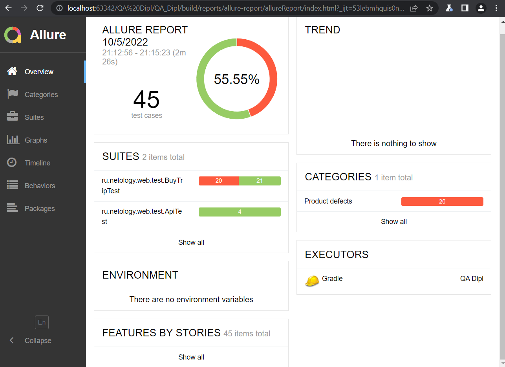

## Краткое описание
В проекте реализованы UI, API и DB автотесты 
Настроена возможность сохранения данных в одну из двух БД: MySQL или PostgresQL 
Кейсами покрыты основные сценарии, проверяющие оба варианта покупки тура 
При переключении настроек проверяется корректность записи данных в выбранную БД 
Более подробно запуск тестов в необходимой БД описан в README.md 
## Количество тест-кейсов
- UI: 41 тест 
- API: 4 теста 
- DB: в UI тесты 4 и 5 добавлены проверки на правильность записи данных в БД MySQL/PostgresQL 
## % успешных/не успешных
По результатам запуска тестового прогона получены следующие итоги: 
- Успешно пройдено: 25 тестов 
- Ошибка: 20 тестов 

## Общие рекомендации
Для увеличения количества успешно пройденных тестов необходимо исправить указанные в проекте issues 